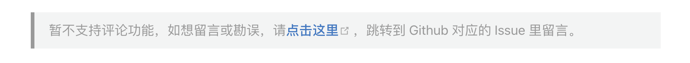

> 点击勘误[issues](https://github.com/webVueBlog/learn-React/issues)，哪吒感谢大家的阅读

## 学前必读

哪吒希望能为开发人员提供最大程度的愉悦开发体验。提供便捷的阅读文档，帮助前端开发小团体高效率的工作进度，并维护本站learn-React 文档。

## 留言评论

因为目前没有留言功能，请拉到文章底部，跳转到对应的 Github Issues，在 Issues 留言回复。



## 感谢指正

指正不胜感激，无以回报。

## 声明

学习文档，仅适合本人食用！！!

## React

React 是一个用于构建用户界面的 JAVASCRIPT 库。

React 主要用于构建 UI，很多人认为 React 是 MVC 中的 V（视图）。

React 拥有较高的性能，代码逻辑非常简单。

## React 特点

1. 声明式设计 −React采用声明范式，可以轻松描述应用。
2. 高效 −React通过对DOM的模拟，最大限度地减少与DOM的交互。
3. 灵活 −React可以与已知的库或框架很好地配合。
4. JSX − JSX 是 JavaScript 语法的扩展。React 开发不一定使用 JSX ，但我们建议使用它。
5. 组件 − 通过 React 构建组件，使得代码更加容易得到复用，能够很好的应用在大项目的开发中。
6. 单向响应的数据流 − React 实现了单向响应的数据流，从而减少了重复代码，这也是它为什么比传统数据绑定更简单。

## React 第一个实例

```js
<!DOCTYPE html>
<html>
<head>
<meta charset="UTF-8" />
<title>Hello React!</title>
<script src="https://cdn.staticfile.org/react/16.4.0/umd/react.development.js"></script>
<script src="https://cdn.staticfile.org/react-dom/16.4.0/umd/react-dom.development.js"></script>
<script src="https://cdn.staticfile.org/babel-standalone/6.26.0/babel.min.js"></script>
</head>
<body>

<div id="example"></div>
<script type="text/babel">
ReactDOM.render(
	<h1>Hello, world!</h1>,
	document.getElementById('example')
);
</script>

</body>
</html>
```

或者使用 create-react-app 工具 创建的 react 开发环境：

```js
import React from "react";
import ReactDOM from "react-dom";

function Hello(props) {
  return <h1>Hello World!</h1>;
}

ReactDOM.render(<Hello />, document.getElementById("root"));
```
